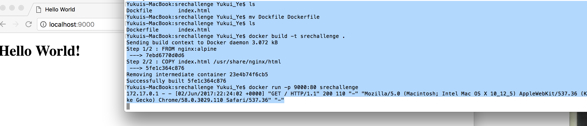

# srechallenge
Run a web server through Docker, Dockerfile, docker build, docker run



Create and deploy a running instance of a web server using a Docker container. The web server serve one web page. Making http request to port 9000, mapping to port 80 in the container. 

* Create a Dockerfile to generate a new Docker image based on the NGINX image from Doker Hub in order to display the web page index.html file. 
* Create NGINX image by running command from the directory where the Dockerfile located: docker build -t srechallenge . 
* Create the container using the image by running the command: docker run -p 9000:80 srechallenge 

```
[polavaram@docker-test ~]$ ls
Dockfile	index.html
[polavaram@docker-test ~]$ mv Dockfile Dockerfile
[polavaram@docker-test ~]$ls
Dockerfile	index.html
[polavaram@docker-test ~]$ docker build -t srechallenge .
Sending build context to Docker daemon 3.072 kB
Step 1/2 : FROM nginx:alpine
 ---> 7ebd6770d0d6
Step 2/2 : COPY index.html /usr/share/nginx/html
 ---> 5fe1c364c876
Removing intermediate container 23e4b74f6cb5
Successfully built 5fe1c364c876
[polavaram@docker-test ~]$ docker run -p 9000:80 srechallenge
172.17.0.1 - - [02/Jun/2017:22:24:02 +0000] "GET / HTTP/1.1" 200 110 "-" "Mozilla/5.0 (Macintosh; Intel Mac OS X 10_12_5) AppleWebKit/537.36 (KHTML, like Gecko) Chrome/58.0.3029.110 Safari/537.36" "-"

```


My building configuration environment:
```
[polavaram@docker-test ~]$ docker version
Client:
 Version:      17.03.1-ce
 API version:  1.27
 Go version:   go1.7.5
 Git commit:   c6d412e
 Built:        Tue Mar 28 00:40:02 2017
 OS/Arch:      darwin/amd64

Server:
 Version:      17.03.1-ce
 API version:  1.27 (minimum version 1.12)
 Go version:   go1.7.5
 Git commit:   c6d412e
 Built:        Fri Mar 24 00:00:50 2017
 OS/Arch:      linux/amd64
 Experimental: true
 ```

